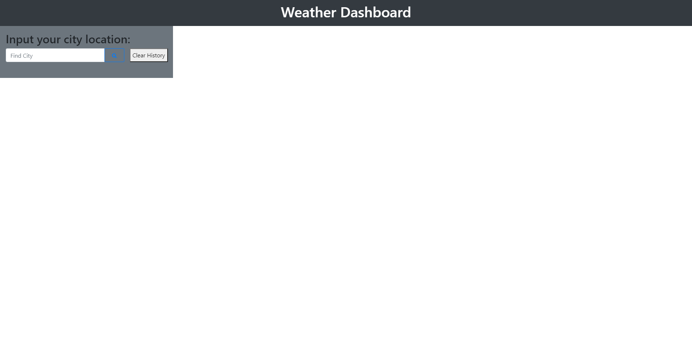
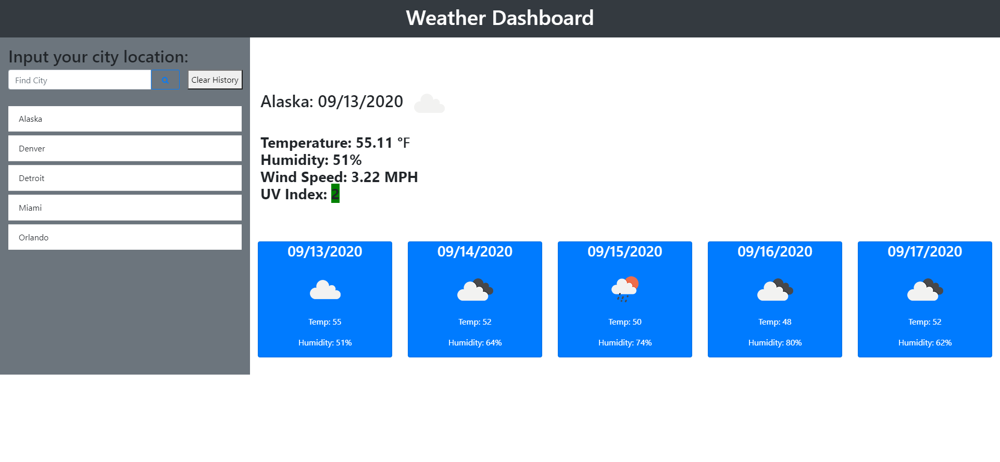
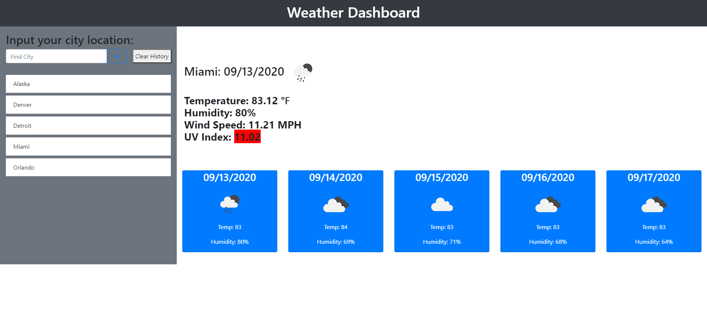

# weather-forecast
The weather forecast application is created using 

* Utilization of third party API's such as Bootstrap and Jquery to have
consistent coding structure and simpler formatting 
* Fetch methods utilizing async and await methods to force inputs to be valid before going through the entire code
* Reading API's information through JSON files 
* Localstorage functions to hold city function values (Possibly could have manipulated the API's information to make some objects for each of the input to distribute the information, but with time frame it was not currently feasible)
* Ability to use moment.js within code to validate, parse, manipulate current dates and utilize that information with another API's information

## Example snapshots and Usage
When beginning the application there is a header at the top displaying the name of the application and a search button to input the location of the user

Once the city is inputted and verified to not be an empty string the function will being to display all of the information for the current day and the next 5 days upcoming

NOTE: CURRENTLY THE APPLICATION DOES NOT ACCOUNT FOR INPUTS THAT DO NOT LINK TO THE CITY NAMES IN THE API. THIS WILL BE A BUG TO FIX LATER IN THE FUTURE!

The UV index will chang colors according to how high the UV values are from the API and deem them favourable, moderate, or severe based on a number index. 
All of the inputted cities will also be listed in the history section on the left and are able to be clicked to reinput their weather info into the dashboard.

## Links to the project
You can find this linked at https://aznjp.github.io/weather-forecast/